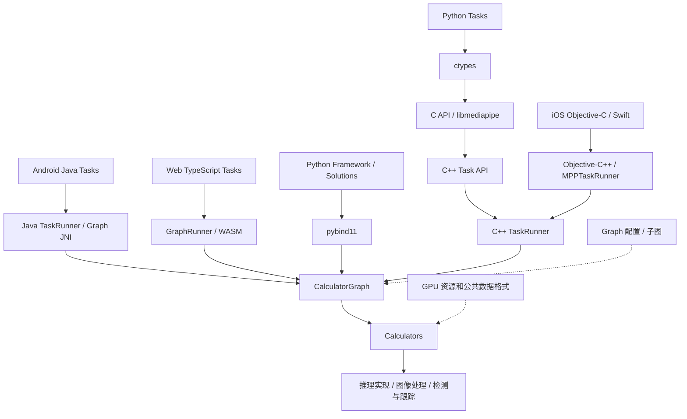

# 项目整体结构

本文根据 2026-09-30 的当前工作树整理，覆盖已跟踪文件与新增源码，并反映本次按 MediaPipe 原有职责分层完成的目录迁移。已经执行源码、构建目标、CPU 和 Metal 测试验证，具体范围与环境限制见第 9 节。

当前项目以 MediaPipe 的图执行框架和跨平台 Tasks API 为基础，扩展了 YOLO 检测、旋转框检测、切片批量推理、视频切片调度和目标跟踪。核心运行时代码主要使用 C++，各平台通过不同的桥接方式复用图和计算节点。

## 1. 顶层目录

```text
mediapipe/
├── MODULE.bazel / MODULE.bazel.lock   # Bzlmod 模块、工具链和依赖锁定
├── WORKSPACE                         # 外部源码、平台库及补丁接入
├── BUILD.bazel                       # 根包构建声明、TypeScript 配置
├── .bazelrc / .bazelversion           # 构建选项、平台配置、Bazel 版本
├── setup.py / MANIFEST.in             # Python 包构建和文件收集
├── requirements*.txt                 # Python 依赖与锁定文件
├── package.json / pnpm-lock.yaml      # Web 开发依赖
├── tsconfig.json                     # TypeScript 编译配置
├── build_* / setup_*                 # 平台构建和环境配置脚本
├── mediapipe/                        # 核心源码
├── third_party/                      # 第三方库适配、补丁和 BoTSORT 源码
└── docs/                             # 框架说明、使用文档、API 文档生成工具
```

核心源码进一步划分为：

```text
mediapipe/
├── framework/       # Packet、Timestamp、CalculatorGraph、调度器和公共数据格式
├── calculators/     # 可复用计算节点：图像、张量、推理、检测、跟踪等
├── gpu/             # GPU 上下文、缓冲区、纹理、同步和资源池
├── tasks/           # 高层任务及各语言 API
├── graphs/          # 应用图与独立可复用子图，包括 tracking/subgraphs/
├── modules/         # 人脸、手部、姿态等领域子图及资源
├── python/          # Python Framework 绑定和 legacy Solutions
├── java/            # Android Framework Java/JNI 支撑
├── objc/            # Apple 平台 Framework 桥接、相机和渲染支撑
├── web/             # Web GraphRunner 和 WASM 桥接支撑
├── util/            # 图像、资源、标签、NMS、切片矩阵和缓存等公共工具
├── model_maker/     # 模型定制、训练与导出工具，独立 Python 包
├── models/          # 模型资源及相关构建声明
├── examples/        # 桌面、移动端、Web 等示例与 PyTorch YOLO 桥接示例
└── docs/            # 源码树内的示例说明
```

YOLO 的本地权重、ONNX 导出中间产物、SavedModel 和校准数据集中在 `mediapipe/tasks/testdata/vision/.yolo_export_cache/`。供测试使用的最终模型和标签文件仍与导出脚本平级，位于 `mediapipe/tasks/testdata/vision/`；缓存和模型资源的管理方式见第 8 节。

## 2. 整体调用关系

各语言共用 C++ 图执行能力，但桥接入口不同。C API 主要承接 C 调用和当前 Python Tasks 绑定。



职责划分如下：

| 层级 | 主要职责 | 主要位置 |
|---|---|---|
| 平台 API | 输入和参数封装、回调、结果类型、语言对象转换 | `tasks/{c,python,java,ios,web}/` |
| C++ Task | 对外任务接口、模型和配置管理、处理模式 | `tasks/cc/` |
| 图组装 | 连接预处理、推理、后处理和跟踪节点 | 各 Task 的 `*_graph.cc`、`tasks/cc/components/processors/`、`graphs/`、`modules/` |
| 图执行 | 时间戳同步、流管理、调度、生命周期 | `framework/` |
| 计算节点 | 完成具体处理步骤，通过 Packet 交换数据 | `calculators/`、Tasks 内的 calculators |
| 公共支撑 | 图像和张量存储、GPU 资源、第三方库 | `framework/formats/`、`gpu/`、`util/`、`third_party/` |

定制检测功能沿用 MediaPipe 的职责划分：跨节点交换的数据结构放在 `framework/formats/`，纯算法和缓存工具放在 `util/`，具体处理节点按输入输出和处理领域放入 `calculators/`，Tasks 共用的流水线组合放在 `tasks/cc/components/processors/`。GPU 资源生命周期由 `gpu/` 支撑，第三方运行时适配和链接检查归入 `third_party/`。这样可以让 Tasks 复用底层组件，同时保持共享数据格式和算法工具独立于高层 Task。

## 3. Framework：图执行引擎

[`mediapipe/framework/`](../mediapipe/framework/) 是整个项目的运行时基础。

| 核心对象 | 作用 | 入口文件 |
|---|---|---|
| `Packet` | 封装有类型的数据和时间戳，在流中传递 | [`packet.h`](../mediapipe/framework/packet.h) |
| `Timestamp` | 表达输入顺序、同步边界与特殊时间状态 | [`timestamp.h`](../mediapipe/framework/timestamp.h) |
| `Calculator` | 声明输入输出约束，执行 `Open / Process / Close` | [`calculator_base.h`](../mediapipe/framework/calculator_base.h) |
| `CalculatorGraph` | 初始化图、投递输入、获取输出、关闭或取消执行 | [`calculator_graph.h`](../mediapipe/framework/calculator_graph.h) |
| `CalculatorGraphConfig` | 描述节点、流、Side Packet 和执行配置 | [`calculator.proto`](../mediapipe/framework/calculator.proto) |
| `Scheduler` | 根据输入就绪状态安排节点执行 | [`scheduler.h`](../mediapipe/framework/scheduler.h) |

其他重要子目录：

- `api2/`：类型化节点接口和 C++ Graph Builder，当前 Tasks 图中大量使用。
- `api3/`：更新的 Calculator、Node、Graph 和 Packet API，与已有框架互操作。
- `formats/`：`Image`、`ImageFrame`、`Tensor`、检测框、旋转框、切片与批次信息，以及缓存诊断统计等共享数据格式。
- `stream_handler/`：输入输出流处理与同步策略。
- `profiler/`、`debug/`：运行分析与调试。
- `port/`、`deps/`：平台适配和基础依赖封装。
- `tool/`：图配置处理、验证和构建辅助工具。

典型执行过程是：加载或生成 Graph 配置 → `Initialize` → `StartRun` → 按时间戳投递 Packet → 节点执行并输出 → 关闭输入流并等待完成。Tasks 在此基础上提供同步处理和异步回调。

## 4. Calculators 和 GPU 支撑

[`mediapipe/calculators/`](../mediapipe/calculators/) 按处理领域组织计算节点：

| 目录 | 内容 |
|---|---|
| `core/` | 流控制、集合操作、循环和通用图节点 |
| `image/` | 图像变换和图像处理 |
| `video/` | 视频帧处理、BoTSORT 跟踪和视频切片调度 |
| `tensor/` | 图像转张量、推理、YOLO 普通框/旋转框张量解码、切片到张量的批处理 |
| `tflite/`、`tensorflow/` | 对应运行时的计算节点与集成 |
| `util/` | NMS/旋转 NMS、框变换、渲染，以及检测框和 ROI 处理节点：切片规划、结果展平/合并、帧级抑制、标签转换和时间戳门控 |
| `audio/` | 音频处理 |

节点通常由 `.cc` 实现、`.proto` 参数和 `BUILD` 目标共同组成。图通过注册名称选择节点；把节点加入构建依赖并保留注册代码，是图能够找到实现的前提。

[`mediapipe/gpu/`](../mediapipe/gpu/) 提供 OpenGL/EGL、Metal、WebGPU 相关资源，以及纹理、缓冲区转换、同步和资源复用。它和 `framework/formats/Tensor` 等类型共同支撑 GPU 节点，不负责对外定义某个检测任务。

切片 GPU 缓冲区的资源域、状态与复用账本定义在 [`tiling_gpu_resource.h`](../mediapipe/gpu/tiling_gpu_resource.h)。纯 NMS、切片坐标矩阵和缓存算法则位于 `mediapipe/util/` 的 `detection_nms_util.*`、`tiling_matrix_utils.*` 和 `tiling_cache_utils.h`；Calculator 在处理 Packet 时调用这些工具。

当前 `tensor/` 推理实现包括 CPU、XNNPACK、OpenGL、Metal，以及 LiteRT 的 Calculator/Runner。外部依赖中接入了 LiteRT；不能仅根据 `tflite/` 目录名判断实际链接的是哪套运行时，应查看对应 `BUILD`。

## 5. Tasks：高层任务接口

```text
mediapipe/tasks/
├── cc/
│   ├── core/          # TaskRunner、BaseOptions、模型资源和任务基类
│   ├── components/    # 结果容器、通用计算组件、Tasks 共用处理子图
│   ├── vision/        # 视觉任务
│   ├── text/          # 文本分类、语言检测、文本嵌入等
│   ├── audio/         # 音频分类及相关处理
│   └── metadata/      # C++ 模型元数据支撑
├── c/                 # C 接口和聚合共享库
├── python/            # Python Tasks，当前主要通过 ctypes 调用 C API
├── java/              # Android Java Tasks
├── javatests/         # Java 测试
├── ios/               # Objective-C API、Objective-C++ 桥接和平台打包
├── web/               # TypeScript Tasks、结果转换和 Web 打包
├── metadata/          # 模型元数据 schema 与工具
└── testdata/          # 模型、图片、音频等测试资源及构建声明
```

视觉任务位于 [`tasks/cc/vision/`](../mediapipe/tasks/cc/vision/)，包含人脸检测和关键点、手部和姿态关键点、手势识别、图像分类/嵌入/分割、交互式分割、目标检测等；当前扩展另设 `yolo_object_detector/` 和 `oriented_object_detector/`。

一个 C++ Task 通常包含：

```text
<task>/
├── <task>.h / <task>.cc       # 对外接口、输入和输出封装
├── <task>_graph.cc            # 图组装与 Calculator 连接
├── proto/                    # 任务参数和生成的 proto 目标
├── <task>_test.cc             # 任务测试
└── BUILD                     # 库、图、proto 和测试依赖
```

Tasks 之间共享的处理流程位于 [`tasks/cc/components/processors/`](../mediapipe/tasks/cc/components/processors/)。该目录既包含通用预处理、后处理子图，也包含当前 YOLO/OBB 共用的切片前端、切片结果合并和跟踪子图；公共图选项位于其 `proto/` 子目录。对应流水线和组合行为测试与这些子图放在同一层。

[`TaskRunner`](../mediapipe/tasks/cc/core/task_runner.h) 管理图执行，提供同步 `Process`、异步 `Send` 和关闭/重启等操作；[`ModelTaskGraph`](../mediapipe/tasks/cc/core/model_task_graph.h) 为模型子图提供资源创建、缓存及推理节点组装能力。视觉任务进一步封装 IMAGE、VIDEO 和 LIVE_STREAM 等模式；各语言提供的模式并不完全相同，例如当前 Web 的运行模式为 IMAGE 和 VIDEO。

## 6. 当前定制检测链路

### 6.1 YOLO 与旋转框检测

| 模块 | 作用 | 位置 |
|---|---|---|
| YOLO Task | 普通矩形框检测，以及切片、视频跟踪等配置 | [`yolo_object_detector/`](../mediapipe/tasks/cc/vision/yolo_object_detector/) |
| OBB Task | 旋转矩形框检测，包含切片和 BoTSORT 跟踪配置 | [`oriented_object_detector/`](../mediapipe/tasks/cc/vision/oriented_object_detector/) |
| YOLO 解码 | 将检测头张量转换成批量普通框检测 | [`yolo_tensors_to_detections_calculator.cc`](../mediapipe/calculators/tensor/yolo_tensors_to_detections_calculator.cc) |
| YOLO OBB 解码 | 将检测头张量转换成批量旋转框检测 | [`yolo_obb_tensors_to_oriented_detections_calculator.cc`](../mediapipe/calculators/tensor/yolo_obb_tensors_to_oriented_detections_calculator.cc) |
| 旋转框格式 | 图内部旋转框数据，供解码、投影、合并和跟踪交换 | [`oriented_detection.proto`](../mediapipe/framework/formats/oriented_detection.proto) |
| Task 结果转换 | 将旋转框转换为像素单位结果及可选跟踪 ID | [`oriented_object_detection_result.h`](../mediapipe/tasks/cc/components/containers/oriented_object_detection_result.h) |

简化处理过程如下，具体分支由 Task 的 Graph 配置决定：

```text
输入图像或视频帧
    → 图像预处理 / 可选切片和批次打包
    → InferenceCalculator
    → YOLO 普通框解码 / OBB 旋转框解码
    → 坐标投影、批次展平或切片合并
    → NMS / 旋转 NMS / 帧级抑制
    → 可选跟踪
    → Task 结果转换 → 平台 API
```

### 6.2 切片与视频调度

[`tasks/cc/components/processors/`](../mediapipe/tasks/cc/components/processors/) 组装切片前端、普通框/旋转框合并和跟踪等 Tasks 共用子图，公共选项由 [`proto/tiled_detection_graph_options.proto`](../mediapipe/tasks/cc/components/processors/proto/tiled_detection_graph_options.proto) 定义。节点按职责分布在不同目录：

| 位置 | 主要实现与职责 |
|---|---|
| `calculators/util/` | `tile_grid_calculator.cc`、`tile_spec_to_tile_plan_calculator.cc` 生成网格与切片计划；`merge_tile_*_detections_accumulator_calculator.cc` 合并切片结果；`yolo*_batch_detections_to_single_calculator.cc` 展平批次；`tiled_frame_suppression_calculator.cc` 执行普通框帧级抑制 |
| `calculators/tensor/` | `streaming_tiles_to_tensor_batch_calculator.cc` 预处理切片并打包模型输入张量；YOLO/OBB 解码器把模型输出张量转换成检测结果 |
| `calculators/video/` | `video_tile_scheduler_calculator.cc` 根据视频状态选择本帧需要检测的区域；BoTSORT 节点负责连续帧目标关联 |
| `util/` | `tiling_matrix_utils.*`、`detection_nms_util.*`、`tiling_cache_utils.h` 提供纯坐标变换、抑制与缓存算法 |

共用子图包括 `tiled_detection_front_graph.cc`、带运动调度的 `tiled_detection_stream_front_graph.cc`、普通框/旋转框合并图，以及组合跟踪的 `tiled_box_track_merge_graph.cc`、`tiled_obb_track_merge_graph.cc` 和 `tiled_tracking_graph.cc`。独立光流子图 [`optical_flow_tracking_graph.pbtxt`](../mediapipe/graphs/tracking/subgraphs/optical_flow_tracking_graph.pbtxt) 位于已有的 `graphs/tracking/subgraphs/`。

[`tiling_types.h`](../mediapipe/framework/formats/tiling_types.h) 定义 `TilePlan` 和 `TensorBatchInfo` 等共享类型，记录切片几何、批次编号和原始帧时间戳，让推理后的多个批次重新归并到同一帧。

[`tiling_cache_stats.h`](../mediapipe/framework/formats/tiling_cache_stats.h) 定义可选 `CACHE_STATS` 输出中的诊断快照；纯缓存计数类型定义在 [`cache_stats.h`](../mediapipe/framework/formats/cache_stats.h)，由 `util/tiling_cache_utils.h` 中的缓存算法引用，使共享统计格式无需依赖算法工具。统计信息用于观察缓存和资源池，不承担推理批次的同步与合并。

[`inference_metadata.proto`](../mediapipe/framework/formats/inference_metadata.proto) 描述实际模型的输入输出形状、数据类型、批容量和输入尺寸等信息。CPU 推理节点可以通过可选 Side Packet 输出这些元信息，切片节点也有消费接口；当前 Task 的切片子图主要通过选项传入模型维度，不能把元信息协议描述为所有 Task 已自动接通的动态配置链路。

切片预处理还包含 `streaming_tiles_to_tensor_batch_gl.*` 和 `streaming_tiles_to_tensor_batch_metal.*` GPU 实现。当前高层 YOLO/OBB Task 的切片前端使用 CPU `ImageFrame` 路径；底层存在 GPU 直写 Tensor 和相关测试源码，不能据此把整个 Task 描述为端到端 GPU 零拷贝。

### 6.3 跟踪

普通框链路有光流/BoxTracker 和 BoTSORT 相关路径；旋转框链路有 BoTSORT 跟踪节点。跟踪负责在连续帧之间关联目标、维护 ID；视频切片调度负责选择检测区域，两者职责不同。

主要实现位置是 `tasks/cc/components/processors/` 中的跟踪组合图、[`botsort_tracking_calculator.cc`](../mediapipe/calculators/video/botsort_tracking_calculator.cc)、[`oriented_botsort_tracking_calculator.cc`](../mediapipe/calculators/video/oriented_botsort_tracking_calculator.cc)、`graphs/tracking/`、`util/tracking/` 和 [`third_party/botsort/`](../third_party/botsort/)。

YOLO 的切片视频图可按配置启用运动调度前端；未启用时仍使用普通切片前端，OBB 当前也使用普通切片前端。两个 Task 的 BoTSORT 配置要求启用切片且运行于 VIDEO 或 LIVE_STREAM；OBB 不接受 BOX_TRACKER。OBB 的 BoTSORT 节点通过轴对齐框关联本帧旋转框并赋予 ID，不预测旋转，也不补出仅由跟踪器生成的旋转框。当前 vendored BoTSORT 使用 CPU 运动模型与匹配，ReID 为占位接口，没有接入完整外观特征推理后端。

### 6.4 后端接入边界

- **LiteRT/TFLite 系列**：已有 Calculator、Runner、delegate 和构建依赖，是当前图内推理的重要实现。
- **ONNX Runtime**：macOS 本地库适配位于 [`onnxruntime_macos.BUILD`](../third_party/onnxruntime_macos.BUILD)，链接检查源码位于 [`onnxruntime_link_smoke_test.cc`](../third_party/onnxruntime_link_smoke_test.cc)，另有模型导出脚本；没有发现完整的 `OnnxInferenceCalculator`，因此不能视为已完成通用图内 ONNX 推理接入。
- **PyTorch**：[`examples/pytorch_yolo/`](../mediapipe/examples/pytorch_yolo/) 使用 Python 中的 PyTorch 执行模型，再通过 pybind11 把输出张量送入 C++ YOLO 解码/NMS 图。这与在图内直接运行 LibTorch 是不同的接入方式。

## 7. 各语言绑定的实际结构

| 平台 | 桥接路线 | 关键入口 |
|---|---|---|
| C | C 函数与结构体 → C++ Task | [`tasks/c/BUILD`](../mediapipe/tasks/c/BUILD) 和 `tasks/c/vision/` |
| Python Tasks | ctypes → 平台共享库 → C API → C++ Task | [`mediapipe_c_bindings.py`](../mediapipe/tasks/python/core/mediapipe_c_bindings.py) |
| Python Framework | pybind11 → C++ Graph、Packet 等 | [`framework_bindings.cc`](../mediapipe/python/framework_bindings.cc) |
| Android | Java TaskRunner → Java Graph/Packet → JNI → 原生图 | [`TaskRunner.java`](../mediapipe/tasks/java/com/google/mediapipe/tasks/core/TaskRunner.java) |
| iOS | Objective-C/Swift 接口 → Objective-C++ → C++ TaskRunner | [`MPPTaskRunner.mm`](../mediapipe/tasks/ios/core/sources/MPPTaskRunner.mm) |
| Web | TypeScript TaskRunner → GraphRunner → WASM 中的图 | [`vision_task_runner.ts`](../mediapipe/tasks/web/vision/core/vision_task_runner.ts) |

各平台的 `components/containers/` 定义结果类型，`processors/` 或 `utils/` 承担底层数据和语言对象之间的转换。C 聚合共享库根据平台输出 `.so`、`.dylib` 或 `.dll`；`//mediapipe/tasks/c:libmediapipe` 是选择平台产物的别名。

当前 YOLO/OBB 的 API 落点：

| 平台 | YOLO | 旋转框检测 |
|---|---|---|
| C++ | `tasks/cc/vision/yolo_object_detector/` | `tasks/cc/vision/oriented_object_detector/` |
| C | `tasks/c/vision/yolo_object_detector/` | `tasks/c/vision/oriented_object_detector/` |
| Python | `tasks/python/vision/yolo_object_detector.py` | `tasks/python/vision/oriented_object_detector.py` |
| iOS | `tasks/ios/vision/yolo_object_detector/` | `tasks/ios/vision/oriented_object_detector/` |
| Android | `tasks/java/com/google/mediapipe/tasks/vision/yoloobjectdetector/` | `tasks/java/com/google/mediapipe/tasks/vision/orientedobjectdetector/` |
| Web | `tasks/web/vision/yolo_object_detector/` | `tasks/web/vision/oriented_object_detector/` |

这里的路径均相对于 `mediapipe/` 源码目录。当前 C/Python 的检测实现已纳入版本控制；iOS、Android、Web 的新增检测 Task 目录仍包含未跟踪源码，其公共 `BUILD` 已有集成改动。以上描述的是工作树状态，不能据此认定平台包已经构建或发布。

另有两个入口细节：Python `tasks/python/vision/__init__.py` 尚未导出 YOLO/OBB 类，使用时需要从具体模块导入；Web 的新增 Task 需要包含对应图注册的自定义 WASM，`custom_vision_wasm_fileset.ts` 提供相关声明和检查。

## 8. 模型、示例和文档

- `modules/` 提供可复用领域子图及模型资源；`graphs/` 组织独立应用图和领域子图；`tasks/cc/components/processors/` 组织 Tasks 共用处理流程；`examples/` 提供运行宿主、输入输出及演示代码。
- `model_maker/` 有独立 `setup.py` 和依赖文件。当前主要实现包含图像分类、目标检测、手势识别和文本分类；`python/llm/` 目录存在，但不能仅凭目录认定已有完整 LLM 微调实现。
- `tasks/metadata/` 维护模型元数据格式与工具；`tasks/cc/core/` 维护模型加载、资源与缓存。
- `models/`、各级 `testdata/` 及 `BUILD` 中的数据依赖共同管理模型和样例；部分测试资源通过外部下载声明提供，并非全部直接保存在 Git 中。
- YOLO 导出脚本位于 `tasks/testdata/vision/`，包括 `export_yolov8n_tflite.py`、`export_yolov8n_obb_tflite.py` 和 `export_yolov8n_onnx.py`。脚本把下载权重与导出中间产物写入同目录的 `.yolo_export_cache/`，最终 `.tflite`、`.onnx` 和标签文件保留在 `vision/` 下供现有测试引用；输出目录由脚本位置决定，可从不同工作目录执行。缓存与部分最终模型是本地可重建资源，存在于工作树不代表已经纳入版本控制。
- 根 `docs/` 保存框架概念、使用说明和 API 文档生成工具；`mediapipe/docs/` 保存部分示例说明；任务和示例目录也可有自己的 README。

## 9. 构建与测试组织

项目主要使用 Bazel。`.bazelversion` 当前为 `7.7.0`，`.bazelrc` 启用 Bzlmod，主要平台使用 C++20，默认并发为 `128`。`MODULE.bazel` 和 `WORKSPACE` 当前共同承担依赖接入，不能只修改其中之一就假定已覆盖全部外部依赖。

Python 包由根 `setup.py` 驱动，内部调用 Bazel；Web 的 TypeScript、Rollup 和 npm 打包也有 Bazel 声明。Android 和 Apple 构建依赖对应 SDK、工具链及平台库。

以下命令是常用入口。当前验证使用 Python 3.11 的依赖锁定；示例和完整 C 共享库未在本次重建，定制检测测试的实际结果见下方记录：

```bash
# 桌面 CPU 示例
bazel build -c opt --repo_env=HERMETIC_PYTHON_VERSION=3.11 \
  --define MEDIAPIPE_DISABLE_GPU=1 \
  //mediapipe/examples/desktop/hello_world:hello_world

# 按当前平台选择 C 共享库
bazel build -c opt --repo_env=HERMETIC_PYTHON_VERSION=3.11 \
  --define MEDIAPIPE_DISABLE_GPU=1 \
  //mediapipe/tasks/c:libmediapipe

# Framework 和定制检测 Task 测试
bazel test --repo_env=HERMETIC_PYTHON_VERSION=3.11 \
  --define MEDIAPIPE_DISABLE_GPU=1 \
  //mediapipe/framework:calculator_graph_test \
  //mediapipe/tasks/cc/vision/yolo_object_detector:yolo_object_detector_test \
  //mediapipe/tasks/cc/vision/oriented_object_detector:oriented_object_detector_test
```

测试分布遵循代码层级：Framework/Calculator/C++ Task 测试通常与源码同目录；Python Tasks 在 `tasks/python/test/`；Android 在 `tasks/javatests/`；iOS 在 `tasks/ios/test/`；Web 测试通常与 TypeScript 实现相邻。GPU 测试需要匹配其运行环境。

定制检测的单节点测试与对应 Calculator 放在同一目录；切片、视频调度、跟踪组合和 Metal 推理流水线测试位于 `tasks/cc/components/processors/`。`framework/formats/metal_tensor_smoke_test.cc` 检查 Tensor 的 Metal 存储，`third_party/onnxruntime_link_smoke_test.cc` 检查外部运行时链接，这两类检查分别归属基础数据格式与依赖适配层。

当前 macOS 的 OpenCV 和 ONNX Runtime 依赖在 `WORKSPACE` 中通过本地 Homebrew 路径接入；跨机器构建时需要核对路径。LiteRT 与 TensorFlow 来源的 TFLite 库还存在命名空间重叠，`WORKSPACE` 明确要求避免在同一二进制中混合这两套实现。

本次结构迁移的验证记录：

以下测试在包含迁移前已有未提交改动的工作树中执行，其中包括 BoTSORT、结果容器和平台适配修改；结果验证的是该工作树，不代表仅应用结构迁移提交后的独立构建结果。

- 迁移 64 个源码与测试文件，更新对应 Bazel 目标、proto import、生成头文件引用和文档路径；旧位置的引用扫描无残留。
- Bazel 目标解析通过。迁移规则的宏、注册名称、`alwayslink`、编译/链接选项，以及 proto package、字段和扩展编号均保留。
- CPU：27 个测试目标、202 个测试用例全部通过，无跳过，覆盖几何和缓存工具、切片/检测节点、跟踪与调度、共用处理图及 YOLO/OBB Task。
- Metal：`metal_tensor_smoke_test`、`streaming_to_inference_metal_zero_copy_test`、`tiled_zero_copy_detection_metal_test` 三个目标在本机全部通过，无跳过。测试使用 `--test_strategy=standalone` 访问本机 GPU 服务。
- ONNX 链接 smoke test 构建成功，但运行时缺少 Homebrew ONNX Runtime 1.24.3 所依赖的 `libabsl_random_distributions.2601.0.0.dylib`。独立加载该动态库也复现同一错误，因此其运行验证受本机外部依赖环境限制。
- 几何工具脱离 Calculator 依赖后，针对原始矩阵函数的 100,000 组随机输入比较在 `-O0`、`-O2` 下均逐位一致；新增全矩阵回归测试也通过。
- 导出脚本通过语法及 stub 路径检查；现有本地资源迁移经过 SHA-256 校验，最终测试模型没有被覆盖。本次没有下载或重新导出模型。

Android、iOS 和 Web 平台包未在本次重建；目录与引用核验、CPU/Metal 测试不能替代各平台完整打包验证。

## 10. 按需求定位代码

| 要处理的事项 | 优先查看 |
|---|---|
| 修改任务参数或公共行为 | 对应 `tasks/cc/vision/<task>/`、`proto/` 和平台绑定 |
| 修改 YOLO/OBB 张量解码 | `calculators/tensor/yolo*_tensors_to_*` |
| 修改 Tasks 共用切片和跟踪流水线 | `tasks/cc/components/processors/`、`proto/tiled_detection_graph_options.proto` 与对应流水线测试 |
| 修改切片网格、ROI、结果展平或合并 | `calculators/util/` 中的 tile、merge、batch-to-single 相关节点 |
| 修改切片到模型输入的张量打包 | `calculators/tensor/streaming_tiles_to_tensor_batch*` |
| 修改切片矩阵、纯 NMS 或缓存策略 | `util/tiling_matrix_utils.*`、`detection_nms_util.*`、`tiling_cache_utils.h` |
| 修改跟踪 ID、目标关联或视频检测区域调度 | `calculators/video/`、共用跟踪图、`third_party/botsort/` 及各平台结果容器 |
| 修改跨节点切片数据与诊断统计 | `framework/formats/tiling_types.h`、`tiling_cache_stats.h`、`cache_stats.h` |
| 排查图执行、同步或关闭问题 | `framework/calculator_graph.*`、`scheduler.*`、流处理器 |
| 调整 GPU 存储、同步和资源复用 | `gpu/`、`framework/formats/tensor*`、具体 GPU Calculator |
| 修改 Python Tasks 桥接 | `tasks/python/`、`tasks/c/` 和共享库聚合 `BUILD` |
| 修改 Android/iOS/Web 入口 | 平台 Task、GraphRunner/TaskRunner、结果转换和打包 `BUILD` |
| 修改依赖或平台构建 | `MODULE.bazel`、`WORKSPACE`、`.bazelrc`、`third_party/` |
| 重建 YOLO 测试模型和导出资源 | `tasks/testdata/vision/export_yolov8n*.py` 与 `.yolo_export_cache/` |

阅读定制检测功能时，可以从 Task 的公共头文件开始，进入 `*_graph.cc` 查看流水线，再沿依赖找到切片、推理、解码、抑制和跟踪节点，最后查看结果容器与平台转换代码。
